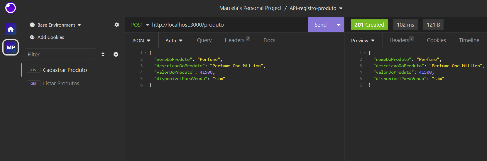
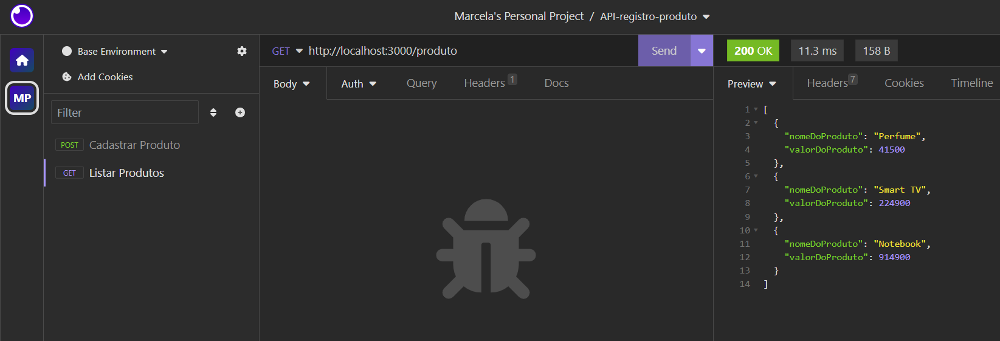

># API-registro-produto
## 📂 Descrição do projeto
A API REST de Registro de Produtos foi desenvolvida para realizar cadastro e listagem de produtos, com input dos dados através do Body no framework Insomnia.

## ⚙ Funcionalidades
* Cadastrar Produto

* Listar Produtos

## 🛠 Linguagens e Ferramentas utilizadas


## 📤 Executando o projeto

Para começar a utilizar a API REST do Registro de Produto na sua máquina, siga estas etapas:

```shell
# 1. Faça o Fork do repositório

# 2. Clone o projeto

git clone <um-dos-links-abaixo>

HTTPS:
https://github.com/MarcelaLinhares/API-registro-produto.git

SSH:
git@github.com:MarcelaLinhares/API-registro-produto.git

# 3. No VS Code instale as dependências

npm install

# 4. Execute o servidor

npm run dev

```

Para realizar as requisições com os verbos GET, POST use o framework Insomnia ou similar.

Abra o insomnia e use a URL Base:
http://localhost:3000/

## 📑 Endpoints no Insomnia
- [ ] CadastrarProduto - **POST**
```javascript
http://localhost:3000/produto
```
```javascript
// No body (JSON) preencher os dados da requisição:
// O valor do produto deve ser fornecido em centavos
{
	"nomeDoProduto": "Perfume",
	"descricaoDoProduto": "Perfume One Million",
	"valorDoProduto": 41500,
	"disponivelParaVenda": "sim"
}
```



- [ ] Listar Produtos - **GET**
```javascript
http://localhost:3000/produto
```




## 🤝 Contribua com o Projeto

- [ ] Realize o Fork
- [ ] Faça as modificações
- [ ] Realize o Pull Request (PR)

## 👩‍💻 Desenvolvedores

<table>
  <tr>
    <td align="center"><a href="https://github.com/MarcelaLinhares"><br /><sub><b>Marcela Linhares</b></sub></a><br /></td>
